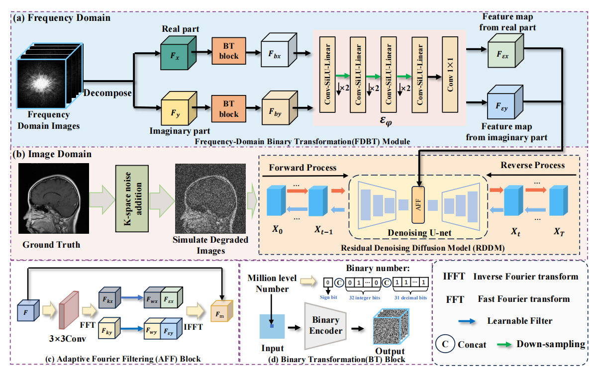

<h1 align="center">FIDNet: Frequency-Informed Diffusion Network for Low-Field MRI Enhancement</h1>

<p align="center">
  A frequency-informed diffusion framework for low-field MRI enhancement.
</p>

<p align="center">
  This repository contains the training script, testing script, model implementation, and dataset pipeline used in FIDNet.
</p>

## Tables of Contents

- [Framework](#framework)
- [Installation](#installation)
- [Getting Started](#getting-started)
- [Acknowledgements](#acknowledgements)

## Framework



FIDNet combines frequency-domain feature extraction with a residual denoising diffusion process for image restoration. The implementation in this repository includes:

- a frequency-domain branch with binary transformation modules
- an adaptive Fourier filtering block
- a residual denoising diffusion model for restoration in the image domain

## Installation

The environment description below is written according to the actual imports used in this repository.

### Requirements

- Python 3.8 or newer
- PyTorch
- torchvision
- accelerate
- einops
- ema-pytorch
- pillow
- numpy
- opencv-python
- tqdm
- Augmentor
- lmdb

You can create a `conda` environment or a `venv`, then install the dependencies with `pip`.

```bash
pip install torch torchvision accelerate einops ema-pytorch pillow numpy opencv-python tqdm Augmentor lmdb
```

## Getting Started

### Dataset Preparation

Before running the code, update the dataset paths in [train.py](./train.py#L40) and [test.py](./test.py#L40) so they match your local data locations.

The current implementation uses paired paths for both training and validation or testing. Please set the four paths in the following order:

- ground-truth training paths
- input training paths
- ground-truth validation or testing paths
- input validation or testing paths

The dataset-related code is located in [datasets](./datasets).

### Training

Training only requires:

```bash
python train.py
```

You can also optionally pass the number of sampling timesteps:

```bash
python train.py 10
```

Notes:

- `train.py` sets `CUDA_VISIBLE_DEVICES=0`
- the default image size is `256`
- checkpoints and sampled outputs are saved under `./results`
- the current script resumes from `trainer.load(60)`, so modify or remove that line if you want to start from scratch

### Testing

Testing only requires:

```bash
python test.py
```

Notes:

- `test.py` sets `CUDA_VISIBLE_DEVICES=0`
- the current script loads checkpoint `trainer.load(100)`
- output images are saved to the folder set by `trainer.set_results_folder(...)`
- update the testing dataset paths in `test.py` before running

### Repository Structure

```text
FIDNet/
|-- datasets/
|-- src/
|-- train.py
|-- test.py
|-- fidnet_architecture.png
`-- README.md
```

